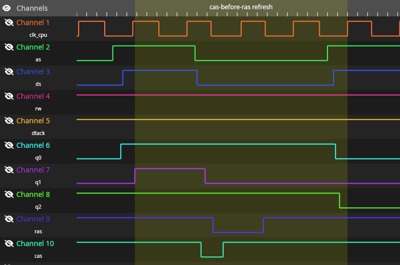

# GAL Equations and JEDEC files

Trump Card contains 2 programable logic chips for several functions:
* Chip 1 is in charge of the I/O and Rom mapping, incorporate the mechanism to pagged in and out ROM and RAM in 0xC0000 on boot to allow JS ROM to start.
* Chip 2 is in charge of the RAS/CAS generation and other signals for the RAM chips.

In the original cards, both chips are of type PAL16L8, that is obsolete nowdays.

There is only 1 version of the Chip 1, and have a sticker with "1V4"

There is 2 diferent version of Chip 1, one for Trump Card 1 (with 24 RAM chips) labeled "2V2" and another for Trump Card 2 (6 RAM chips) labeled "2V4"

## Tetroid

This directory there is the equations shared by Tetroid and others in several places of internet.

Chip 1 is know to work if burn in a GAL16V8 chip, included JED files of the TC1, TC2 and Tetroid version, that are equal when disasembled.

Chip 2 for TC1 include dump and GALASM source.

Chip 2 for TC2 include JED for GAL and PAL, but is know that only the PAL work.

## only_minerva

My own version of the equations of the chip 1, intended to be used in a board without RAM with external RAM expansion.

This version only work with Minerva ROM, because it lack the pagging mechanism needed to boot in a JS ROM, this version is save to use with 768Kb external expansion, to achive the 892Kb (maximun RAM in a QL)

Include the Winculp source.

## wip

The Work-In-Progress ecuations

Chip 1 version with the pagging mechanish that work in JS and Minerva Roms. Miracle sell serveral version of the card with diferent memory configurations, its not clear if the ecuations of the chips are the same in all version, but in my test I need to develop version for each memory configuration. Source is in GALASM format

Only 0Kb has been tested, this GAL is Safe to use with any external RAM expansion up to 512 Kb, can also be used my own +256Kb RAM expansion if wire the P13 of GAL1 to the RAM expansion Card.

Chip 2 are still not working, but include some test in GALASM and Winculp formats, and some notes.

# Technical Details

Our guest of the timmings need for access memory of the trump card are as per next graphics:

Normal read cycle

A refresh cycle using cas-before-ras method

A read cycle plus a hidden refresh using a second RAS pulse.

