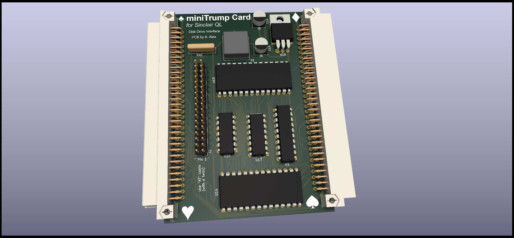

# SINCLAIR QL Mini Trump Card 3 Disk Interface

(C) 2022 Alvaro Alea Fernandez

License under: CERN Open Hardware Licence Version 2 - Strongly Reciprocal

https://ohwr.org/cern_ohl_s_v2.txt

This is a new PCB for the well know Trump Card Interface.

## Advantages

This PCB add a passthrough conector to allow aditional interfaces.

It's also a lot smaller than original one.

It's use standar AT cable (with a twist) and standar AT disc drives (drives configures as 2nd unit)

## Drawbacks

But it do not have memory, you need a Memory Expansion.

It only support 2 Disk Drive, no way to use 3 or 4 Drives

Also it's only compatible with Minerva Rom

For the GAL code, use the 1V4 from my other project Trump Card 2 Clone.

# Technical Info

It work with WD1770 and WD1772 floppy disc controlllers.

