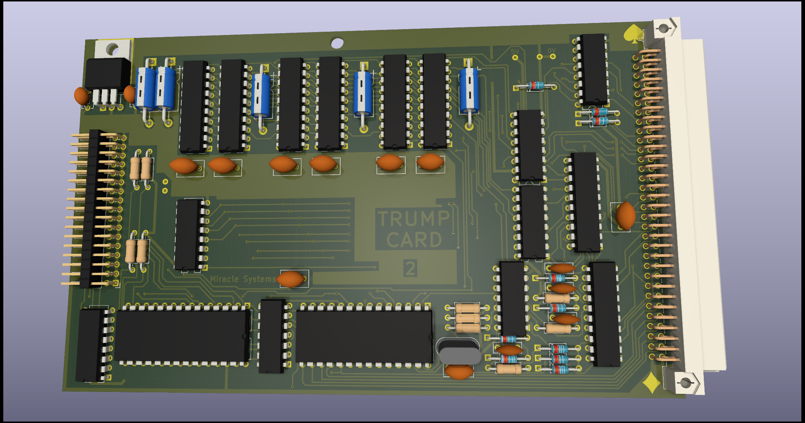
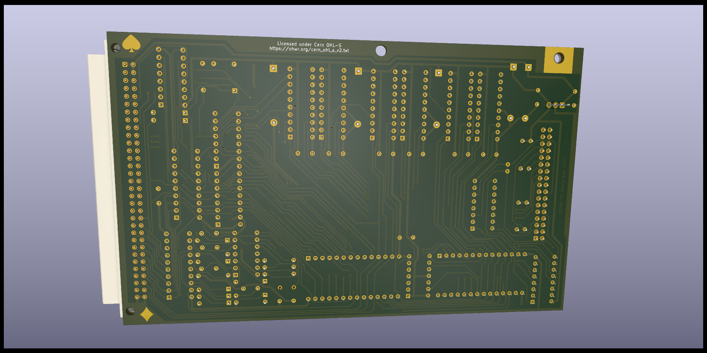

# SINCLAIR QL Trump Card V2 disk interface

(C) 2022 Alvaro Alea Fernandez

License under: CERN Open Hardware Licence Version 2 - Strongly Reciprocal

https://ohwr.org/cern_ohl_s_v2.txt

Available in the market in 4 ways, 0K, 256Kb/ACE, 512Kb, 768Kb and Treo (256Kb aditional).

Only 0Kb has been tested.

Check the readme in the GAL folder, up to now, I only be able to make it work without RAM.

# Technical Info

## Components to use.

### 4040
We found that not all manufacturer made CD4040 or 74HC4040 in the same way, and some made counter with rise-edge of clock, and some with falling-edge.

The trump card need falling edge or will mess with the refresh cycle and do not work.

The eprom/gal programer TL-866 II+ has a function to test TLL chips, but fail to detect it and consider valid both variants.

We have include the file 4040-test.lgc with a custom test that when load on the programmer allow to detect valid 74HC4040 variants. (best to use 74HC4040 that CD4040)

### RAM Chips
Trump Card use 514256 Ram chips, this is 4bits x 256K (1Mbit) Dinamic RAM.

Trump Card use a special refresh mode of this chips called hidden refresh, but not all manufacturer implement in tha same way.

Has been reported that Texas Instrument TMS44C256 are not valid and will cause errors on boot.

Motorola (MCM514256) Siemens (HYB514256) and OKI (MSM514256) has been reported to work

Toshiba (TC514256) and GoldStart (GM71C4256) al also valid acording to datasheet, but not tested.

The trump card schematic used 0 wait state ram, even in the refresh cycle, and for that peed of the DRam, it shall be between 70 and 100ns, 120ns or slower are not valid.

HOLD

 

 

